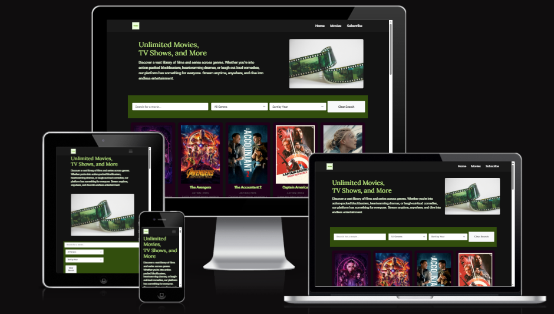
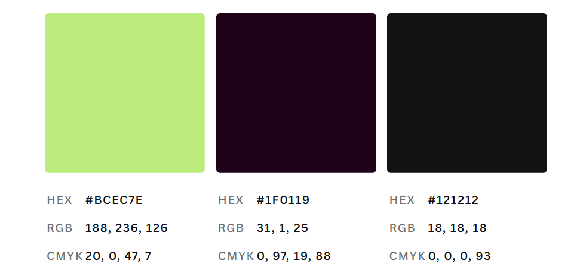
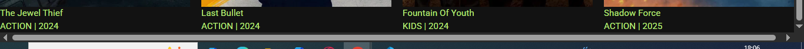
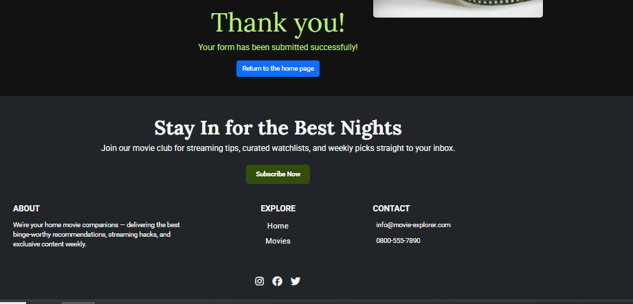
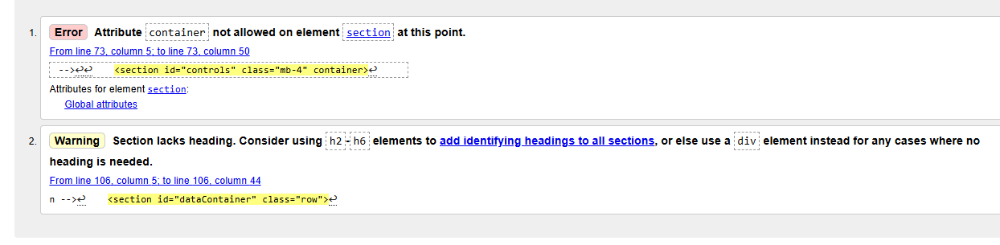
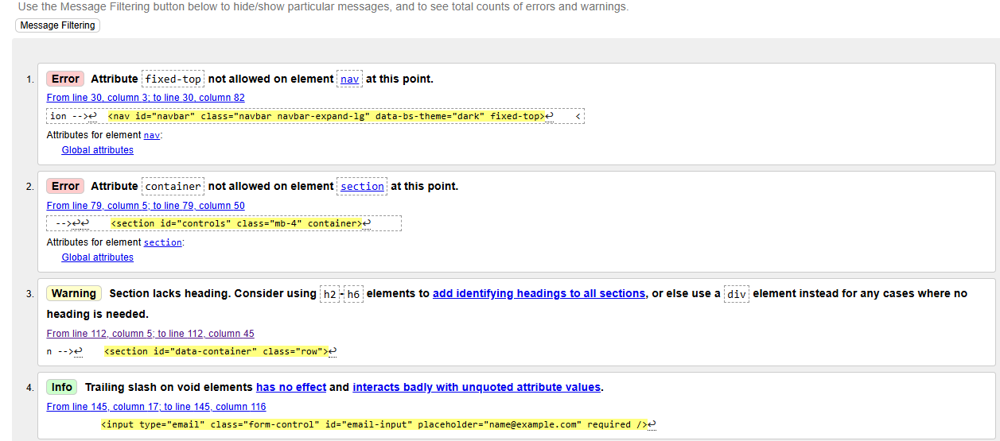
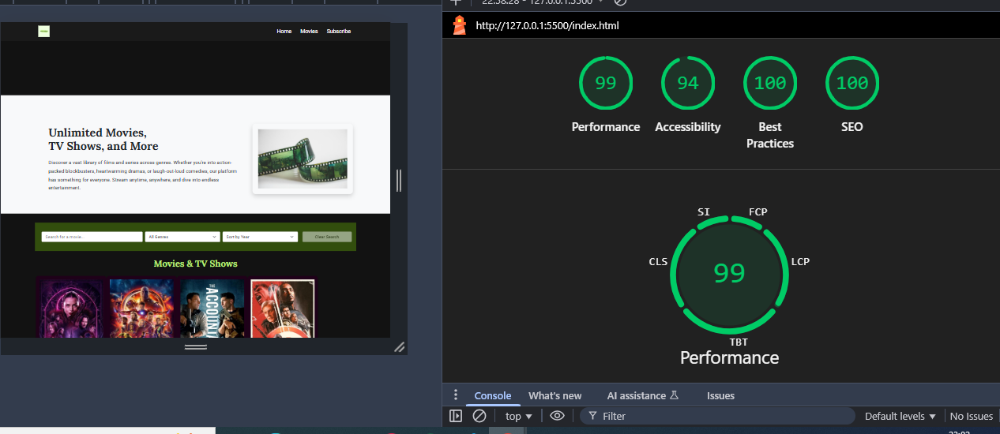
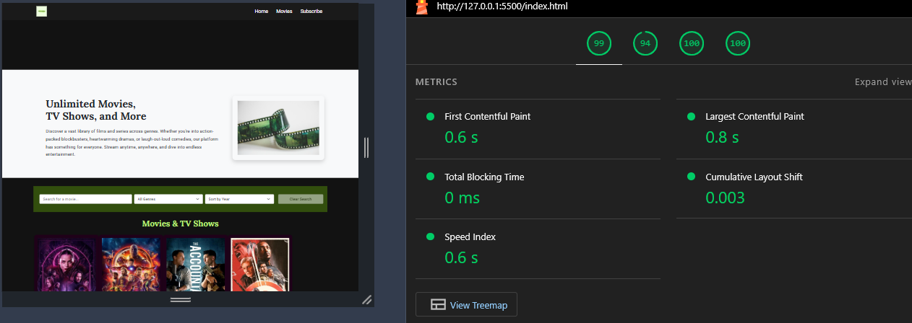
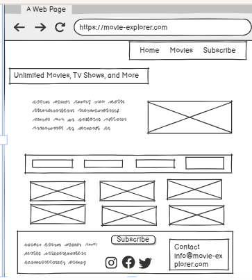
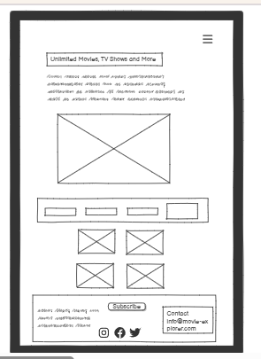

## Movie Explorer Website
Welcome to Movie Explorer, your ultimate destination for discovering and exploring movies. Browse through a curated collection of films across genres like Action, Comedy, Drama, and Kids. Whether you're searching for a classic favorite or the latest hit, Movie Explorer helps you find movies you’ll love—fast and easily. Dive in, search, filter, and enjoy the world of cinema at your fingertips.


Table of Contents
1. [Overview](#overview)
2. [Key Features](#key-features)
3. [Purpose](#purpose)
4. [Goal](#goal)
5. [Flow-Steps](#flow-steps)
6. [Rationale](#rationale)
7. [Testing](#testing)
8. [User Experience (UX Design)](#user-experience-ux-design)
9. [Balsamiq-Wireframe](#balsamiq-wireframe)
10. [Technologies Used](#technologies-used)
11. [Project Setup](#project-setup)
12. [Installation](#installation)
13. [Deployment](#deployment)
14. [Acknowledgements](#acknowledgements)


## Overview

The Interactive Movie Explorer is a responsive, user-friendly web application that allows users to browse, search, filter, and interact with a curated list of movies. Designed using HTML, CSS, and JavaScript, the site enables users to quickly find movies by title or genre, sort them by release year, and even subscribe to updates or contact the site owner through embedded forms.

## Project Link

You can view the live project here: [Movie Explorer](https://victor400.github.io/movie-explorer/)



## Key Features 

Search Functionality: Quickly find movies by typing keywords into the search bar.

Genre Filtering: Narrow down movie selections by choosing specific genres like Action, Drama, Comedy, or Kids.

Sorting Options: Sort movies by release year in ascending or descending order.

Responsive Design: Optimized for various devices, ensuring a consistent experience across desktops, tablets, and mobile phones.

Dynamic Rendering: Movie cards are dynamically generated based on user interactions, providing real-time feedback.


## Purpose 

The purpose of the Movie Explorer project is to provide users with an intuitive, searchable, and filterable interface to discover and explore a curated list of movies. It supports different genres and includes edge case handling to test robustness across data-driven scenarios.


## Goal 

- Build a reliable and testable front-end application that displays movies from fixture data.

- Allow filtering by genre (e.g., Action, Kids).

- Integrate automated testing using Cypress to ensure data integrity and user flow reliability.

- Ensure resilience by handling missing or malformed data gracefully in both the UI and tests.

## Flow Steps

Description of Flow Steps:

- Load Homepage: The application initializes and displays the homepage with navigation and search/filter options.

- User Inputs Search Criteria: The user enters a movie title in the search bar, selects a genre from the dropdown menu, and chooses a sort order (e.g., by year ascending or descending).

- Application Processes Input: The application filters the movie dataset based on the search criteria and sorts the filtered list according to the selected order.

- Display Results: The application renders movie cards matching the criteria in the display section.

- User Selects a Movie: The user clicks on a movie card to view more details.

- Display Movie Details: The application shows detailed information about the selected movie description

Future Improvement 

-  User Action: The user may choose to rent the movie, add it to a watchlist, or return to the search results.


## Rationale

Users often face difficulty navigating large collections of movies due to overwhelming options, inconsistent categorization, or missing data. This leads to frustration, poor user experience, and decision fatigue.

Movie Explorer addresses this by offering:

- A clean, filterable interface to explore movies by genre (e.g., Action, Kids), helping users quickly find content that matches their interests.

- Graceful handling of missing or incomplete data (e.g., movies without titles or genre), ensuring the application remains functional and informative even when the dataset isn’t perfect.

- Automated testing with Cypress, which guarantees reliability of features like genre filtering, loading behavior, and edge case handling—ensuring a trustworthy experience for users.

- A structure that simulates real-world scenarios where applications must perform well despite inconsistent or incomplete backend data.

- By solving both data integrity and user experience challenges, Movie Explorer becomes a robust tool and a strong reference for developers building resilient, user-friendly applications.


## Testing For Project

This project uses **Jest** for unit testing and **Cypress** for end-to-end testing.  
All test-related files are organized under the `/tests` directory.

### 🔧 Scripts

 For full setup and usage details, see 📘 **Test Setup Guide**: [View TESTING.md](tests/setup/TESTING.md)
``` bash
npm test           # Run Jest unit tests
npm run test:watch # Watch mode for Jest
npm run test:e2e   # Launch Cypress test runner
```

## User Experience (UX Design)

### UX Design Considerations

- Consistency: Filter buttons are clearly grouped and responsive across devices.

- Visual Clarity: Movie cards are styled for quick scanning – poster, title, genre, and year are prominent.

- Accessibility: Use semantic HTML and alt text for posters to ensure accessibility.

- Navigation: The persistent header with logo and nav menu helps orientation and usability.

- Call to Action: The “Subscribe ⌄” option is prominent to encourage user engagement.


### 🎨 UI/UX Design

The following colour wheel was used during the design process to guide consistent branding and visual style:



#### 🎨 Style Guide

Below are the main colours used in this project:

| Variable                  | Colour Code |
|---------------------------|-------------|
| `--primary-color`         | `#BCEC7E`    |
| `--secondary-color`       | `#EDFFDE`    |
| `--highlight-color-light` | `#324e0d`    |
| `--background-color`      | `#121212`    |
| `--navbar-color`          | `#1a1a1a`    |
| `--text-color`            | `#ffffff`    |


### User Story 
✅ User Story 1: User-Friendly Navigation and Responsive Design
As a First-Time Visitor,
I need easy navigation and a user-friendly, responsive design,
So that I can quickly and efficiently find information without frustration on any device.

 Acceptance Criteria

- The website layout adjusts fluidly across various screen sizes (mobile, tablet, desktop).

- Navigation links (e.g. Home, Movies, Subscribe) are clearly visible and accessible.

- The navigation bar collapses into a mobile-friendly menu (e.g., hamburger icon) on smaller devices.

- The layout prioritizes readability, usability, and quick access to the main features (search, filter, contact, subscribe).


✅ User Story 2: Search Movies by Title
As a user
I want to search for a movie by typing its name
So that I can quickly find the movie I’m interested in

Acceptance Criteria:

A search input is available on the page.

When the user types into the search bar, the list of movies updates in real-time.

The search is case-insensitive.

If no matches are found, a message “No results found.” is displayed.


✅ User Story 3: Filter Movies by Genre
As a user
I want to filter movies by genre
So that I can narrow down the list to my preferred type of movies

Acceptance Criteria:

A dropdown shows genre options including: All, Action, Comedy, Drama, Kids.

When a genre is selected, only movies of that genre are shown.

Selecting "All" shows every movie.


✅ User Story 4: Sort Movies by Year
As a user
I want to sort movies by their release year
So that I can view movies in chronological order

Acceptance Criteria:

A dropdown allows choosing sort order: "default", "Year ↑ (Oldest)", "Year ↓ (Newest)".

Selecting “Year ↑” sorts movies from oldest to newest.

Selecting “Year ↓” sorts movies from newest to oldest.

✅ User Story 4: Clear Filters
As a user
I want to reset the filters and search input
So that I can return to the full, unfiltered movie list

Acceptance Criteria:

A “Clear Search” button is present.

Clicking the button clears the search input, resets genre filter to “All”, and sort to “default”.

The full list of movies is displayed after clearing.


✅ User Story 5: View Movie Details as Cards
As a user
I want to view movie titles, genres, and years displayed as cards
So that I can quickly understand each movie’s information

Acceptance Criteria:

Movies are displayed as visually distinct cards.

Each card includes the title, genre, and year.

Cards are displayed in a single column and centered.


✅ User Story 6: Navigate Between Site Sections
As a user
I want to navigate to different sections like Home, Movies, About, etc.
So that I can explore other parts of the site easily

Acceptance Criteria:

Navigation menu includes: Home, Movies, Subscribe.

Clicking each menu item scrolls or links to the relevant section (if available).

Navigation menu is visible on all screen sizes.


✅ User Story 7: Subscribe to Updates
As a user
I want to subscribe to updates by entering my email
So that I can receive news or alerts about new movies or site features

Acceptance Criteria:

The "Subscribe" section appears on the page.

The form contains one required field: Email.

A subscribe button is present.

When submitted:

A confirmation alert or message is displayed.

The input field is cleared.

Submissions without a valid email are blocked with validation.


### 🧪 Manual Testing Plan

#### 🔍 User Story 1: Search Movies by Title

| Test Case | Description | Steps | Expected Result | Pass/Fail |
|-----------|-------------|-------|------------------|-----------|
| 1.1 | Search Input Availability | Open homepage | Search bar is visible | ✅ / ❌ |
| 1.2 | Real-time Filtering | Type “Exterritorial” | Only “Exterritorial” is shown | ✅ / ❌ |
| 1.3 | Case-insensitive Search | Type “ballerina”, “BALLERINA” | “Ballerina” is shown | ✅ / ❌ |
| 1.4 | No Match Message | Type “xyzabc” | “No results found.” shown | ✅ / ❌ |

---

#### 🎭 User Story 2: Filter Movies by Genre

| Test Case | Description | Steps | Expected Result | Pass/Fail |
|-----------|-------------|-------|------------------|-----------|
| 2.1 | Genre Options Display | Open genre dropdown | All, Action, Comedy, Drama, Kids shown | ✅ / ❌ |
| 2.2 | Filter by Genre | Select “Action” | Only Action movies shown | ✅ / ❌ |
| 2.3 | Reset with “All” | Select “All” | All movies displayed | ✅ / ❌ |

---

#### 📅 User Story 3: Sort Movies by Year

| Test Case | Description | Steps | Expected Result | Pass/Fail |
|-----------|-------------|-------|------------------|-----------|
| 3.1 | Sort Options Display | Open sort dropdown | Default, Year ↑, Year ↓ shown | ✅ / ❌ |
| 3.2 | Sort Ascending | Select “Year ↑” | Oldest to newest order | ✅ / ❌ |
| 3.3 | Sort Descending | Select “Year ↓” | Newest to oldest order | ✅ / ❌ |

---

#### 🧹 User Story 4: Clear Filters

| Test Case | Description | Steps | Expected Result | Pass/Fail |
|-----------|-------------|-------|------------------|-----------|
| 4.1 | Button Visibility | Locate “Clear Search” button | Button is visible | ✅ / ❌ |
| 4.2 | Clear Functionality | Use filters/search, click button | Inputs reset, all movies shown | ✅ / ❌ |

---

#### 🧾 User Story 5: View Movie Details as Cards

| Test Case | Description | Steps | Expected Result | Pass/Fail |
|-----------|-------------|-------|------------------|-----------|
| 5.1 | Cards Displayed | View movies | Movies are in cards | ✅ / ❌ |
| 5.2 | Card Contents | Inspect card | Poster, Title, Genre, Year present | ✅ / ❌ |
| 5.3 | Layout & Centering | View layout | Cards centered and organized | ✅ / ❌ |

---

#### 🧭 User Story 6: Navigate Between Site Sections

| Test Case | Description | Steps | Expected Result | Pass/Fail |
|-----------|-------------|-------|------------------|-----------|
| 6.1 | Menu Display | View nav menu | Home, Movies, Subscribe visible | ✅ / ❌ |
| 6.2 | Navigation Function | Click menu items | Scrolls/links to section | ✅ / ❌ |
| 6.3 | Responsive Menu | Resize window | Menu still visible | ✅ / ❌ |

---

#### 📬 User Story 7: Subscribe to Updates

| Test Case | Description | Steps | Expected Result | Pass/Fail |
|-----------|-------------|-------|------------------|-----------|
| 8.1 | Form Presence | View Subscribe section | Email input + button shown | ✅ / ❌ |
| 8.2 | Valid Email Submit | Enter valid email & submit | Confirmation shown, input clears | ✅ / ❌ |
| 8.3 | Invalid Email Validation | Enter “test@”, submit | Error shown, submission blocked | ✅ / ❌ |

### Bugs and Fixes
 
- Misaligned Images on 1024px Screen
- Trailling slash on void elements
- Section lacks heading, considered using h2-h6
            







✅ Confirmed fix by resizing the screen and observing correct centering behavior.

### Automated Testing

Automated Test Categories This project includes automated tests that focus on improving the quality and performance of the website. The tests are divided into four main categories:

- Performance Tests "This section showcases the results of the performance tests that evaluate how quickly the website loads and how efficiently it performs under various conditions." Image Description: "Performance testing results chart showing load times, performance score, and areas for improvement."
- Accessibility Tests "The accessibility tests ensure that the website is usable by everyone, including individuals with disabilities. This section highlights the website's accessibility score and key improvements." Image Description: "Accessibility test results displaying contrast ratios, alternative text, and keyboard navigability checks." 
- Best practices tests ensure that the website follows modern web standards for security, code quality, and maintainability. This section showcases adherence to best practices." Image Description: "Results of the best practices test, including code quality scores, security vulnerabilities, and compliance with recommended standards."
- SEO Tests "SEO (Search Engine Optimization) tests evaluate how well the website is optimized for search engines. This section highlights SEO improvements to increase visibility on search engines." Image Description: "SEO audit report showing key optimizations, such as meta tags, page titles, keyword usage, and mobile-friendliness."

**Desktop**
**Homepage Validator Testing** 
- 

**Tablet**
**Homepage Validator Testing** 
- 


## Balsamiq Wireframe
I used Balsamiq Wireframes to design and visualize the layout of the Movie Explorer application across multiple device types. The wireframes helped guide the responsive design for:

- Desktop view 



- Tablet view



Mobile view

These early-stage sketches served as a blueprint throughout development, ensuring a user-friendly and consistent interface across all screen sizes.

## Technologies Used 

### 🛠️ Tech Stack

HTML: Structure the page with header, main content, filter panel, and data area.

CSS: Style for clean UI, responsiveness, and optional themes (dark/light mode).

JavaScript: Handle interactivity, DOM manipulation, and data logic.

## Project Setup
Follow these steps to set up the project locally:

1. Clone the Repository

```bash
git clone https://github.com/your-username/movie-explorer.git
cd movie-explorer
```

2. Project Structure
Ensure your folders are structured like this:

```
/assets
  └── /js
      └── main.js
      └── json/
          └── movies-data.json
/index.html
```
This project runs with plain HTML, CSS, and JavaScript. No build tools are required.

 ## Installation
If your project includes testing tools (like Jest or Cypress), install dependencies:

1. Install Node.js Dependencies (for testing)
Make sure you have Node.js installed, then run:

```
npm install
```

2. Run Tests

- Unit Tests (Jest)

```bash
npm test
```

- End-to-End Tests (Cypress)

```bash
npm run test:e2e
```

## Deployment

To deploy your Movie Explorer project (assuming it's a frontend project with HTML/CSS/JS or React), you can use GitHub Pages or Netlify. Here’s how to do both:

- GitHub Pages (for plain HTML/CSS/JS)
🔧 For Plain HTML/CSS/JS
Push your code to a GitHub repo (you already did).

Rename your main HTML file as index.html if it isn't already.

On GitHub:

Go to your repo → Settings → Pages (left sidebar).

Under Branch, select main and folder as /root.

Click Save.

Your site will be live at:

```php template
https://<your-username>.github.io/<repo-name>

```

## Acknowledgements
I would like to express my sincere gratitude to the following individuals and resources that contributed to the development of this project:

Juliia Konovalova – For guidance, feedback, and continuous support throughout the project.

The Movie Database (TMDb) – For inspiration and reference on organizing movie content.

W3Schools, MDN Web Docs, and Stack Overflow – For helpful examples, documentation, and community advice while resolving technical challenges.

ChatGPT (by OpenAI) – For assistance in code reviews, debugging, and writing support content like documentation 
and test guides.

freeCodeCamp – For offering structured learning paths and tutorials that strengthened my frontend and JavaScript skills.